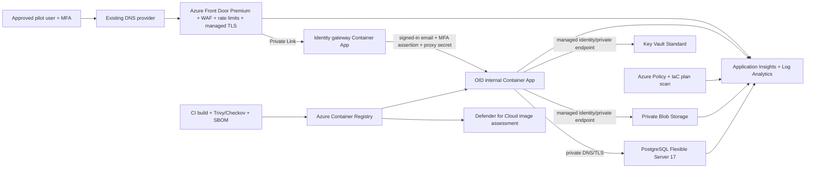

# OID v1 Deployment Architecture Decision

Date: 2026-08-09  
Decision status: **PROPOSED — NOT APPROVED OR DEPLOYED**  
Readiness effect: **None. OID remains A. NOT READY.**

## Decision

Use one Microsoft Azure landing zone for the controlled internal pilot, with strictly separate staging and pilot resources. The public edge is Azure Front Door Premium with Web Application Firewall (WAF). It reaches an identity-gateway Azure Container App through Private Link. The gateway performs Microsoft Entra ID OpenID Connect (OIDC) authentication and injects OID's trusted identity contract. The OID application is a separate internal-ingress Container App. PostgreSQL Flexible Server, Blob Storage, and Key Vault have no public data-plane access.

This choice preserves the existing OID identity-adapter contract and keeps identity, network, runtime, data, secrets, telemetry, policy, and backup evidence in one provider. It is a deployment architecture, not authorization to provision anything.

## Exact service choices

| Category | Primary service | Pilot configuration | Why selected | Cost posture |
|---|---|---|---|---|
| Next.js hosting | Azure Container Apps, workload-profiles environment | Separate gateway and OID apps; OID internal ingress; public network disabled at environment; minimum replicas determined by load/recovery test | Managed container runtime, revisions and traffic rollback, VNet integration | Consumption compute can fall within the monthly free grant; private endpoint/network and non-consumption features are billable. Do not assume $0. |
| Image registry | Azure Container Registry Basic | Private registry; admin account disabled; managed-identity pull; immutable digest recorded | Simple Azure-native private image chain | Paid daily. |
| PostgreSQL | Azure Database for PostgreSQL Flexible Server 17 | Smallest validated Burstable SKU; private access only; TLS; separate staging/pilot servers; 35-day PITR | Managed patching and backups with a private endpoint/VNet path | Paid compute and storage; staging may be stopped when unused, but storage/backup charges remain. |
| Private object storage | Azure Storage GPv2, Hot LRS for pilot | Separate staging/pilot accounts; private blob container; public network and anonymous access disabled; Shared Key disabled; managed identity; versioning; blob/container soft delete 35 days; lifecycle policy | Meets private evidence-storage and recovery requirements with low operations | Paid by capacity, operations, redundancy, transfer, versions and private endpoint. |
| Secrets | Azure Key Vault Standard | Separate staging/pilot vaults; RBAC; private endpoint; soft delete and purge protection; workload identities only | Central rotation and access audit without secrets in images or settings exports | Paid per operation plus private endpoint; normally low pilot usage, but not free. |
| SSO/MFA | Microsoft Entra ID + Conditional Access P1 | Single-tenant app registration; named users; phishing-resistant MFA preferred; block legacy authentication; two monitored break-glass accounts excluded only from the pilot policy | Existing Microsoft identity direction, group governance and revocation | P1 is currently listed at $6/user/month paid yearly, or may already be included in Microsoft 365 Business Premium/E3. Confirm tenant licensing. |
| Identity bridge | Security-reviewed OIDC gateway image on Container Apps | Pin image by digest; validate issuer/audience/signature/nonce; require MFA claim; strip inbound identity headers; inject `x-oid-user-email`, `x-oid-mfa`, and `x-oid-proxy-secret`; no direct OID ingress | Current OID adapter requires the proxy secret in addition to identity headers | Container compute plus security-review time. Gateway choice/image must be approved before deployment. |
| TLS/DNS and edge | Azure Front Door Premium + WAF; existing authoritative DNS provider | Managed certificate; minimum TLS 1.2; WAF prevention mode; private-link origin; origin accessible only through Front Door | Premium supports Private Link to the origin and distributed edge rate limiting | Paid base and usage charges and likely a major pilot line item; managed certificate has no separate procurement task. DNS provider may have no incremental charge. |
| Distributed rate limiting | Front Door WAF custom rate-limit rules | Conservative per-IP login, Ask OID, document and write-route limits; OID's in-app limiter remains defense in depth | Multi-instance/global enforcement before the private origin | Included in the selected paid edge/WAF service; requests and rules affect usage. |
| Central logging/monitoring | Azure Monitor, Log Analytics, Application Insights and Action Groups | Structured redacted logs; diagnostic settings for edge, identity gateway, Container Apps, Key Vault, Blob, PostgreSQL and Activity Log; daily cap; 30-day pilot retention pending governance | One query/alert/audit surface | Activity Log ingestion has free cases; application/log ingestion, retention, queries and some alerts are usage-billed. |
| Database backups | Native Flexible Server backups plus controlled logical export | 35-day PITR; encrypted backup; nightly encrypted `pg_dump` to a separate restricted backup account or approved Azure Backup vault; monthly restore drill during pilot | PITR plus provider-independent logical recovery | Native backup storage up to 100% of provisioned database storage has no extra charge; excess and logical/vault storage are paid. |
| Object recovery | Versioning + soft delete + resource lock; consider vaulted Blob Backup after risk review | 35-day version/soft-delete window, lifecycle controls, restore drill; delete lock on storage account | Covers accidental overwrite/delete while keeping a path to stronger isolation | Versions and backup copies consume paid storage; vaulted backup is an additional paid option. |
| Container/image scanning | Trivy and SBOM in CI, plus Microsoft Defender for Cloud registry image assessment | Block deploy on Critical/High exploitable vulnerabilities unless security signs a time-bounded exception; archive scan JSON, SBOM and image digest | Executable pre-deploy gate plus continuous Azure assessment | Trivy is open source; CI minutes may be within an existing allowance. Defender plan is paid and needs a quote. |
| Infrastructure scanning | Bicep or Terraform plan, Checkov/Trivy config scan, Azure Policy and Defender CSPM | Deny public DB/storage/Key Vault, require TLS/diagnostics/tags, scan every plan, export compliance state | Preventive IaC and provider-state evidence | Open-source plan scanning is free; Azure Policy base capability is available with Azure; Defender CSPM is paid. |

## Required Azure structure and least privilege

- One existing or newly approved Entra tenant and Azure billing subscription owned by Shelby; do not use a personal developer subscription for pilot records.
- Separate resource groups, virtual networks, private DNS zones, vaults, databases, storage accounts, identities, telemetry workspaces, Container Apps environments and hostnames for `oid-staging` and `oid-pilot`.
- Human groups: `OID-Platform-Admins`, `OID-Deployers`, `OID-Security-Readers`, `OID-Backup-Operators`, and the application-role groups defined by `RBAC_MATRIX.md`. Membership must be approved and exported.
- Managed identities: OID runtime (Blob data access and Key Vault secret read only), gateway runtime (its own Key Vault secret read only), deployment identity (resource deployment, no standing data-plane read), and migration job identity (database migration only).
- CI uses workload identity federation. No client secret, ACR password, storage key or Azure credentials in repository settings when federation/managed identity is available.
- Owner remains limited to Shelby and a separately controlled break-glass process. Contributor is not a substitute for data-plane roles.

## Credentials and configuration required

| Item | Secret? | Custodian | Storage/handling |
|---|---:|---|---|
| Azure tenant ID, subscription ID, resource IDs | No | Platform owner | IaC parameters/inventory; no authentication power alone |
| Entra OIDC client ID and redirect URI | No | Identity owner | Deployment configuration |
| Entra OIDC client credential or certificate | Yes | Identity owner | Key Vault only; certificate preferred; rotation and expiry alert required |
| `OID_TRUSTED_PROXY_SECRET` (minimum 32 random bytes) | Yes | Security owner | Separate staging/pilot Key Vault secrets; gateway and OID read access only; rotate after any exposure |
| PostgreSQL runtime and migration connection strings/passwords | Yes | Database owner | Separate Key Vault entries and principals; TLS-required URLs; never in image, Git or evidence bundle |
| Blob account/container names | No | Storage owner | Runtime configuration |
| Blob authorization | No long-lived secret | Storage owner | Runtime managed identity with container-scoped `Storage Blob Data Contributor`; readers only if documented |
| ACR authorization | No long-lived secret | Platform owner | Managed identity `AcrPull`; CI federated identity push role |
| Application Insights connection string | Treat as sensitive configuration | Monitoring owner | Key Vault or protected Container App secret reference; rotate if exposed |
| Break-glass credentials and recovery methods | Yes | Shelby + independent custodian | Provider-approved emergency-access procedure, never repository or shared chat |

## DNS changes eventually required

No DNS is changed until staging security validation and Shelby's recorded approval.

1. Reserve the approved pilot hostname, recommended `oid.oligopolypeptides.com` (or an explicitly approved non-customer-facing subdomain).
2. At the existing DNS provider, add the Azure Front Door domain-validation TXT record (`_dnsauth.<host>`) exactly as supplied by Azure.
3. After validation, add the hostname CNAME to the Front Door endpoint. Do not expose a Container Apps hostname in public DNS.
4. Keep TTL at 300 seconds for the activation window if the provider permits; return to the normal policy after acceptance.
5. Validate certificate issuance, hostname, TLS version, HSTS, WAF routing and origin privacy before adding any pilot user.
6. Rollback is removal/reversion of the CNAME to the previously recorded value. Preserve the TXT validation record only if approved.

## Cost decision

Shelby must approve an Azure Pricing Calculator export before provisioning. It must show region, currency, agreement, expected users, data size, log GB/day, retention, database SKU/storage, private endpoints, Front Door Premium/WAF, Container Apps profile, ACR, Key Vault, Blob, Defender plans, backup and egress.

Items that may be zero incremental during pilot are local Trivy/Checkov, Container Apps consumption compute within its subscription grant, CI minutes within an existing allowance, existing authoritative DNS, and Entra P1 if already licensed. These are allowances, not a zero-cost architecture. Front Door Premium, PostgreSQL, ACR, private endpoints, storage, secrets operations, Defender and production telemetry should be budgeted as paid.

## Rejected alternatives

- **Vercel + separate database/storage/identity vendors:** excellent Next.js ergonomics, but increases provider count, audit surfaces and private-network integration work. It does not fit the current Azure design as cleanly.
- **Azure App Service instead of Container Apps:** viable, but the repository already has a production container and the gateway/OID split benefits from internal container ingress and revision rollback.
- **Public Container Apps origin protected only by a header:** cheaper, but fails the stated private-origin requirement. Front Door Premium Private Link is therefore retained despite cost.
- **Entra P2 for every pilot user:** not required for the baseline MFA/Conditional Access plan. Consider it only if governance requires risk-based Identity Protection or privileged identity features.

## Objective closure conditions

This decision does not close a production gate. Every service remains `BLOCKED_EXTERNAL`, `REQUIRES_OWNER_APPROVAL`, or `REQUIRES_PROFESSIONAL_REVIEW` until the evidence in the activation and validation documents exists. OID must continue to be reported as **A. NOT READY**.

## Official capability and pricing references

- [Azure Container Apps pricing](https://azure.microsoft.com/en-us/pricing/details/container-apps/)
- [Azure Container Apps authentication](https://learn.microsoft.com/en-us/azure/container-apps/authentication)
- [Container Apps private endpoints](https://learn.microsoft.com/en-gb/azure/container-apps/how-to-use-private-endpoint)
- [Azure Front Door billing and Private Link](https://learn.microsoft.com/en-us/azure/frontdoor/billing)
- [Front Door WAF rate limiting](https://learn.microsoft.com/en-us/azure/web-application-firewall/afds/waf-front-door-rate-limit-configure)
- [Microsoft Entra pricing](https://www.microsoft.com/en-us/security/business/microsoft-entra-pricing)
- [PostgreSQL Flexible Server pricing](https://azure.microsoft.com/en-us/pricing/details/postgresql/flexible-server/)
- [PostgreSQL backup and restore](https://learn.microsoft.com/en-us/azure/postgresql/backup-restore/concepts-backup-restore)
- [Blob Storage pricing](https://azure.microsoft.com/en-us/pricing/details/storage/blobs/)
- [Storage private endpoints](https://learn.microsoft.com/en-us/azure/storage/common/storage-private-endpoints)
- [Prevent Shared Key authorization](https://learn.microsoft.com/en-us/azure/storage/common/shared-key-authorization-prevent)
- [Blob data protection](https://learn.microsoft.com/en-us/azure/storage/blobs/data-protection-overview)
- [Key Vault pricing](https://azure.microsoft.com/en-us/pricing/details/key-vault/)
- [Azure Monitor pricing](https://azure.microsoft.com/en-us/pricing/details/monitor/)
- [Defender registry image vulnerability assessment](https://learn.microsoft.com/en-us/azure/defender-for-cloud/view-and-remediate-vulnerability-registry-images)
- [Azure Policy](https://learn.microsoft.com/en-us/azure/governance/policy/)

## Final blocker closure table

| BLOCKER | REQUIRED ACTION | OWNER | EXTERNAL SERVICE | COST EXPECTED | EVIDENCE TO CLOSE |
|---|---|---|---|---|---|
| Actual SSO/MFA | Configure Entra app, Conditional Access, named groups, revocation and gateway claim validation | Identity owner + Security | Entra ID P1 | $6/user/month paid yearly unless included | Policy export, app manifest, successful MFA, non-MFA denial, disabled-user and revoked-session tests |
| TLS/DNS | Provision Front Door Premium/WAF/private origin, validate domain, add approved DNS records | Platform owner + Shelby/DNS owner | Front Door Premium + DNS provider | Paid edge; DNS may be existing | DNS record export, managed-cert status, TLS scan, origin-private test, rollback record |
| Managed secrets | Provision private Key Vaults, identities, rotation and expiry alerts; inject references | Security/Platform | Key Vault | Usage + private endpoint | Vault policy/RBAC exports, public-denial test, secret-reference deployment, rotation drill, no-secret scan |
| Private PostgreSQL | Provision staging/pilot Flexible Servers with private connectivity, TLS and least privilege | Database owner | Azure PostgreSQL Flexible Server | Paid compute/storage/network | Configuration export, public-connect denial, app/migration connectivity, least-privilege test, PITR drill |
| Private object storage | Provision private Blob accounts with Entra authorization, protection and recovery | Storage owner + Quality | Azure Blob Storage | Paid storage/operations/network | Public/anonymous/Shared-Key denial, RBAC tests, SHA-256 and duplicate/version tests, audit logs, restore drill |
| Distributed rate limiting | Configure and load-test Front Door WAF rate rules | Security/Platform | Front Door WAF | Included in paid edge plan/usage | WAF export, 429 tests by route, normal-use non-regression, alert evidence |
| Central monitoring | Connect all diagnostic sources; redact; set alerts, retention and escalation | Monitoring owner + Security | Azure Monitor/App Insights/Log Analytics | Usage-based | Data-source inventory, saved queries, alert delivery/acknowledgment test, log redaction sample |
| Production backups | Set 35-day PITR and logical/object recovery; test restore and document RPO/RTO | Database/Storage owners + Quality | PostgreSQL backups, Blob protection/Azure Backup if approved | Native allowance plus paid excess/copies | Backup policy export, immutable job logs, separate restore target, reconciled restore report, owner sign-off |
| Executable image scanning | Run Trivy/SBOM in CI and Defender registry assessment; enforce severity policy | Security + Deployment owner | CI, ACR, Defender for Cloud | OSS may be free; ACR/Defender paid | Scan JSON, SBOM, digest/signature, clean/approved-exception report, failed-build proof |
| Infrastructure scanning | Define IaC, scan plans, assign Azure Policy, remediate findings | Platform + Security | Checkov/Trivy config, Azure Policy, Defender CSPM | OSS/Policy base may be free; CSPM paid | IaC plan, scan output, policy compliance export, zero unapproved High/Critical findings |
| Owner/quality/security/governance/legal approvals | Complete independent reviews and signed go/no-go records | Shelby + designated reviewers | Professional services as selected | Professional time likely paid | Named, dated approvals with scope/version; all mandatory items checked and no unresolved veto |
