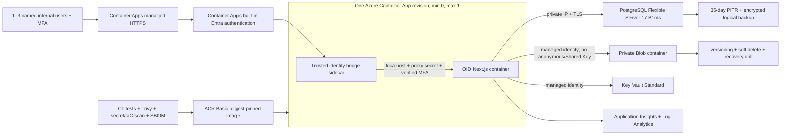

# OID Lean Azure Controlled-Pilot Architecture

Date: 2026-08-09  
Status: **proposed only — not approved, provisioned, deployed, or DNS-connected**

## Purpose and boundaries

This is the minimum recommended Azure topology for 1–3 named internal users and low traffic. It preserves every OID application control and creates a direct upgrade path to the accepted enterprise reference. It is not a production architecture and does not authorize real customer/supplier data, WooCommerce, payments, public access, or DNS changes.

## Architecture

### Request path

1. Azure Container Apps terminates TLS using its provider hostname during acceptance and a free managed custom-domain certificate only after separately approved DNS work.
2. Container Apps built-in authentication rejects unauthenticated requests and signs users in through the single-tenant Entra application.
3. A small identity-bridge sidecar receives only platform-authenticated traffic. It parses the platform's trusted principal claims, verifies the tenant/user and actual MFA evidence, removes any inbound OID identity headers, and injects the existing `OID_IDENTITY_EMAIL_HEADER`, `x-oid-mfa=true`, and `OID_TRUSTED_PROXY_SECRET` toward localhost.
4. The OID container is not directly exposed on ingress. It re-verifies the proxy secret, active database user and database roles on each request.
5. The Container App has at most one replica during the pilot. OID's rate limiter therefore has one authoritative process. Horizontal scaling is prohibited until distributed throttling is added.

The bridge is deployment integration, not a new product feature. Its source/image, claims mapping and failure behavior require independent security review and negative testing.

## Minimum services

| Service | Pilot configuration | Why it remains |
|---|---|---|
| Azure Container Apps Consumption | One multi-container app; min replicas 0, max 1; external HTTPS only to bridge; OID bound to localhost; managed identity; revision rollback | Lowest-cost managed container path while retaining the repository Docker build and scale-to-zero |
| Microsoft Entra ID | Single-tenant app; assignment limited to named users; MFA; sessions/revocation tested | Strong workforce identity and a direct path to later Conditional Access |
| Azure Database for PostgreSQL Flexible Server 17 | B1ms/32 GiB initial; private VNet integration and private DNS; TLS; separate migration/runtime principals; 35-day PITR | OID's integrity, audit, release and allocation controls depend on PostgreSQL and private connectivity |
| Azure Blob Storage GPv2 Hot LRS | Private container; anonymous and Shared Key disabled; public network restricted to selected VNet/service paths where supported; managed identity; encryption, versions and 35-day soft delete | Private document access, hashes, duplicate/version evidence and recovery |
| Azure Key Vault Standard | Managed identity; RBAC; purge protection; soft delete; diagnostics; VNet service endpoint/firewall where supported | Managed secrets, rotation and access logs without source/image secrets |
| Azure Container Registry Basic | Admin credentials disabled; federated CI push; managed-identity pull; deploy by digest | Private image chain with minimal monthly charge |
| Azure Monitor/Application Insights/Log Analytics | Redacted structured application logs plus auth, Container Apps, Key Vault, Blob, PostgreSQL and Activity Log sources; daily cap and minimal alert set | Central audit/availability/security evidence and alerting |
| Azure VNet/private DNS | Container Apps integration subnet plus delegated PostgreSQL subnet and private DNS | Removes the database public endpoint without per-service Private Link everywhere |

## Identity and MFA decision

### Lowest-cost acceptable path

Use Entra Free Security Defaults only if all of the following objectively pass:

- every pilot user and administrator registers and uses MFA;
- the OIDC/platform claim presented to the identity bridge proves MFA and cannot be forged;
- unassigned, disabled and wrong-tenant users are denied;
- user disablement plus session revocation takes effect within the approved SLA;
- no tenant-wide Security Defaults consequence conflicts with other OligoPoly systems;
- the Security reviewer accepts the lack of targeted Conditional Access controls.

### When P1 becomes mandatory

Buy/assign Entra P1 if targeted Conditional Access, authentication-strength selection, sign-in frequency, location/device conditions, group-specific pilot policy, or a reliable MFA claim cannot be achieved and tested under Security Defaults. P1 may already be included in Microsoft 365 Business Premium/E3, so the tenant license inventory comes before purchasing.

No identity mode may set `x-oid-mfa=true` merely because a user has MFA enrolled. It must reflect MFA actually established for the accepted session.

## Network design

- One pilot VNet in the approved U.S. region.
- Container Apps workload/consumption environment integrated into its own subnet.
- PostgreSQL uses a separate delegated subnet and private DNS; no public database endpoint exists.
- Blob and Key Vault use Entra authorization plus firewall/service-endpoint restrictions when supported by the final Container Apps network configuration. If network denial cannot be objectively proved, add a private endpoint for the affected service before pilot activation.
- No Azure Firewall, NAT Gateway, VPN, Bastion or Front Door on day one unless a validated egress/administration requirement makes it necessary.
- Only Container Apps HTTPS ingress is external. Database, OID container port, storage contents, Key Vault and management paths are not publicly accessible to pilot users.

## Secrets and service identities

Mandatory Key Vault items (values never written to plans/evidence):

- Entra OIDC client certificate or client secret;
- `OID_TRUSTED_PROXY_SECRET`, separate from development and at least 32 random bytes;
- PostgreSQL migration and runtime credentials, each least privilege;
- any document adapter configuration credential not replaceable by managed identity;
- monitoring integration credential only if an external notification service is used.

Use the Container App managed identity for Blob read/write, Key Vault secret retrieval and ACR pull. CI uses federated identity for ACR push; ACR admin credentials stay disabled. Rotate the proxy/database/OIDC credentials and prove the prior version fails.

## Controls retained without modification

- Database constraints/triggers, append-only audit semantics and application audit events.
- Quality-only human lot release after complete independent passing evidence and review.
- Operations cannot override Quality.
- Failed/unreviewed/quarantined lots cannot be released or allocated.
- Released-only inventory allocation and quantity integrity.
- Commercial supplier/security isolation and Auditor read-only behavior.
- AI cannot approve suppliers, authorize purchasing/payment, release, allocate or close critical exceptions.
- Ask OID authorization and record-level isolation.
- Sensitive document SHA-256 validation, duplicate detection, version history, authorization-before-retrieval and download audit.

Infrastructure substitution never authorizes a change to these controls.

## Rate limiting

For the pilot, configure Container Apps `maxReplicas=1` and retain/test OID's existing limiter on login/session, Ask OID, document retrieval and state-changing routes. Authentication is enforced before the bridge/OID path. Alert on 401/403/429 spikes.

This is safe only for the defined low-traffic, one-replica internal pilot. Before `maxReplicas` exceeds 1 or external users are added, implement and test a shared/distributed limit (Front Door WAF, managed Redis or equivalent). A second replica without shared throttling is a prohibited configuration drift.

## Backups and recovery

- PostgreSQL: 35-day native PITR; nightly encrypted logical `pg_dump` to a separate restricted backup container; backup identity cannot read operational documents unless necessary; restore only into an isolated server.
- Blob: versioning, blob/container soft delete for 35 days, lifecycle policy, delete lock and a tested version/deletion restore. If Security requires protection from storage-account compromise/deletion, add Azure Backup vaulted Blob backup.
- Containers: retain the prior approved digest/revision and prove traffic rollback.
- Secrets: keep controlled Key Vault versions and a documented rotation rollback that does not reactivate a compromised credential.
- Acceptance: reconcile schema migrations, row/entity counts, lot/test/release/allocation states, document SHA-256 values and audit chronology after restore.

## Minimum monitoring and alerts

Retain redacted telemetry only. Do not log tokens, cookies, secrets, database URLs, document bodies or restricted supplier fields.

Mandatory alerts:

- Container App health/restart/5xx and failed revision;
- authentication failures, wrong tenant/audience/MFA, disabled/revoked access and spoofed trusted headers;
- privileged OID actions/denials, audit-integrity failure and critical exceptions;
- PostgreSQL capacity, connections, errors, backup failure and low burst credits;
- Blob/Key Vault authorization failures, destructive changes, secret expiry and public-access configuration changes;
- Azure RBAC, diagnostic-setting and network-policy changes;
- monthly budget threshold and forecast.

At least two named recipients must receive and acknowledge critical test alerts before activation.

## Deferred components and upgrade triggers

| Deferred component | Add when any trigger occurs |
|---|---|
| Front Door Premium/WAF/Private Link origin | Public/customer portal; meaningful internet threat exposure; global routing; private origin mandated; more than one replica needs edge enforcement |
| Defender for Cloud paid plans | Security requires continuous registry/runtime posture; number/frequency of images grows; regulated/production evidence requires provider-native assessment |
| Broad Azure Policy initiatives | Resources/subscriptions/teams grow; recurring drift occurs; formal compliance mapping requires continuous enforcement |
| Private endpoints for Blob/Key Vault/ACR | Service endpoint/firewall denial cannot be proven; sensitive/real data approved; Security mandates no network-reachable public data plane |
| PostgreSQL HA/General Purpose | Load/credit tests fail; downtime target tightens; live business reliance starts |
| Multiple replicas/distributed rate limiting | Concurrent users/availability require horizontal scale |
| Front Door/global CDN | Customer-facing latency, global availability or bot/WAF requirements appear |
| Azure Backup vault/geo-redundancy | Approved RPO/RTO, ransomware or regional-loss analysis requires independent/remote copies |

## Pilot acceptance conditions

This topology is not safe merely because it is cheaper. Activation remains blocked until SSO/MFA, forged-header rejection, disablement/revocation, RBAC/AI/Ask OID negative tests, passing and failed-test workflows, document controls, public-network denial, secret rotation, alerts, PITR/logical/object restores and required owner/Quality/security/governance/legal approvals all have objective evidence.

OID remains **A. NOT READY** until that separately authorized work is complete.
